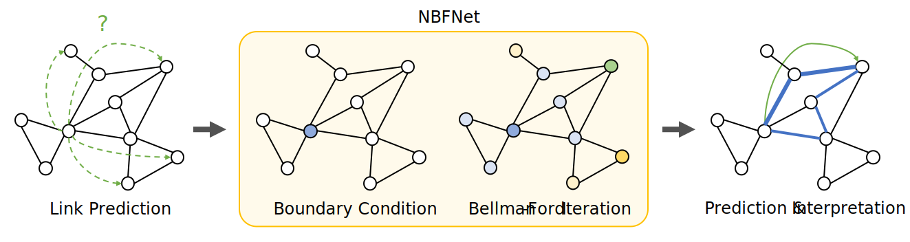

# NBFNet: Neural Bellman-Ford Networks #

This is the official codebase of the paper

[Neural Bellman-Ford Networks: A General Graph Neural Network Framework for Link Prediction][paper]

[Zhaocheng Zhu](https://kiddozhu.github.io),
[Zuobai Zhang](https://oxer11.github.io),
[Louis-Pascal Xhonneux](https://github.com/lpxhonneux),
[Jian Tang](https://jian-tang.com)

[paper]: https://arxiv.org/pdf/2106.06935.pdf

A PyG re-implementation of NBFNet can be found [here](https://github.com/KiddoZhu/NBFNet-PyG).

## Overview ##

NBFNet is a graph neural network framework inspired by traditional path-based
methods. It enjoys the advantages of both traditional path-based methods and modern
graph neural networks, including **generalization in the inductive setting**,
**interpretability**, **high model capacity** and **scalability**. NBFNet can be
applied to solve link prediction on both homogeneous graphs and knowledge graphs.



This codebase is based on PyTorch and [TorchDrug]. It supports training and inference
with multiple GPUs or multiple machines.

[TorchDrug]: https://github.com/DeepGraphLearning/torchdrug

## Installation ##

You may install the dependencies via either conda or pip. Generally, NBFNet works
with Python 3.7/3.8 and PyTorch version >= 1.8.0.

### From Conda ###

```bash
conda install torchdrug pytorch=1.8.2 cudatoolkit=11.1 -c milagraph -c pytorch-lts -c pyg -c conda-forge
conda install ogb easydict pyyaml -c conda-forge
```

### From Pip ###

```bash
pip install torch==1.8.2+cu111 -f https://download.pytorch.org/whl/lts/1.8/torch_lts.html
pip install torchdrug
pip install ogb easydict pyyaml
```

## Reproduction ##

To reproduce the results of NBFNet, use the following command. Alternatively, you
may use `--gpus null` to run NBFNet on a CPU. All the datasets will be automatically
downloaded in the code.

```bash
python script/run.py -c config/inductive/wn18rr.yaml --gpus [0] --version v1
```

We provide the hyperparameters for each experiment in configuration files.
All the configuration files can be found in `config/*/*.yaml`.

For experiments on inductive relation prediction, you need to additionally specify
the split version with `--version v1`.

To run NBFNet with multiple GPUs or multiple machines, use the following commands

```bash
python -m torch.distributed.launch --nproc_per_node=4 script/run.py -c config/inductive/wn18rr.yaml --gpus [0,1,2,3]
```

```bash
python -m torch.distributed.launch --nnodes=4 --nproc_per_node=4 script/run.py -c config/inductive/wn18rr.yaml --gpus [0,1,2,3,0,1,2,3,0,1,2,3,0,1,2,3]
```

### Visualize Interpretations on FB15k-237 ###

Once you have models trained on FB15k237, you can visualize the path interpretations
with the following line. Please replace the checkpoint with your own path.

```bash
python script/visualize.py -c config/knowledge_graph/fb15k237_visualize.yaml --checkpoint /path/to/nbfnet/experiment/model_epoch_20.pth
```

### Evaluate ogbl-biokg ###

Due to the large size of ogbl-biokg, we only evaluate on a small portion of the
validation set during training. The following line evaluates a model on the full
validation / test sets of ogbl-biokg. Please replace the checkpoint with your own
path.

```bash
python script/run.py -c config/knowledge_graph/ogbl-biokg_test.yaml --checkpoint /path/to/nbfnet/experiment/model_epoch_10.pth
```

## Results ##

Here are the results of NBFNet on standard benchmark datasets. All the results are
obtained with 4 V100 GPUs (32GB). Note results may be slightly different if the
model is trained with 1 GPU and/or a smaller batch size.

### Knowledge Graph Completion ###

<table>
    <tr>
        <th>Dataset</th>
        <th>MR</th>
        <th>MRR</th>
        <th>HITS@1</th>
        <th>HITS@3</th>
        <th>HITS@10</th>
    </tr>
    <tr>
        <th>FB15k-237</th>
        <td>114</td>
        <td>0.415</td>
        <td>0.321</td>
        <td>0.454</td>
        <td>0.599</td>
    </tr>
    <tr>
        <th>WN18RR</th>
        <td>636</td>
        <td>0.551</td>
        <td>0.497</td>
        <td>0.573</td>
        <td>0.666</td>
    </tr>
    <tr>
        <th>ogbl-biokg</th>
        <td>-</td>
        <td>0.829</td>
        <td>0.768</td>
        <td>0.870</td>
        <td>0.946</td>
    </tr>
</table>

### Homogeneous Graph Link Prediction ###

<table>
    <tr>
        <th>Dataset</th>
        <th>AUROC</th>
        <th>AP</th>
    </tr>
    <tr>
        <th>Cora</th>
        <td>0.956</td>
        <td>0.962</td>
    </tr>
    <tr>
        <th>CiteSeer</th>
        <td>0.923</td>
        <td>0.936</td>
    </tr>
    <tr>
        <th>PubMed</th>
        <td>0.983</td>
        <td>0.982</td>
    </tr>
</table>

### Inductive Relation Prediction ###

<table>
    <tr>
        <th rowspan="2">Dataset</th>
        <th colspan="4">HITS@10 (50 sample)</th>
    </tr>
    <tr>
        <th>v1</th>
        <th>v2</th>
        <th>v3</th>
        <th>v4</th>
    </tr>
    <tr>
        <th>FB15k-237</th>
        <td>0.834</td>
        <td>0.949</td>
        <td>0.951</td>
        <td>0.960</td>
    </tr>
    <tr>
        <th>WN18RR</th>
        <td>0.948</td>
        <td>0.905</td>
        <td>0.893</td>
        <td>0.890</td>
    </tr>
</table>

Frequently Asked Questions
--------------------------

1. **The code is stuck at the beginning of epoch 0.**

   This is probably because the JIT cache is broken.
   Try `rm -r ~/.cache/torch_extensions/*` and run the code again.

Citation
--------

If you find this codebase useful in your research, please cite the following paper.

```bibtex
@article{zhu2021neural,
  title={Neural bellman-ford networks: A general graph neural network framework for link prediction},
  author={Zhu, Zhaocheng and Zhang, Zuobai and Xhonneux, Louis-Pascal and Tang, Jian},
  journal={Advances in Neural Information Processing Systems},
  volume={34},
  year={2021}
}
```
